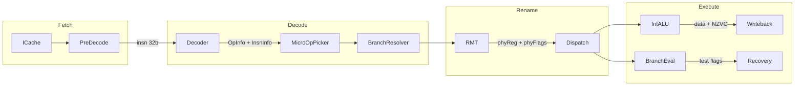

# M65832 Fixed32 Decoder and Flag Support

**Status:** Pending (all phases)
**Last Updated:** March 2026
**Parent:** [Vcore_Roadmap.md](Vcore_Roadmap.md) -- Stages 1-3

## Phase Summary

| Phase | Description | Status |
|-------|-------------|--------|
| 1 | Type System (BasicTypes, MicroArchConf, OpFormat, MicroOp) | Pending |
| 2 | Decoder (new Decoder.sv) | Pending |
| 3 | Branch Resolver (new DecodedBranchResolver.sv) | Pending |
| 4 | Flag Register Plumbing (rename, ALU, writeback) | Pending |
| 5 | Pipeline Stage Updates (immediates, branch targets, operands) | Pending |

The work is organized into 5 phases with clear compile-and-test boundaries.
Each phase builds on the previous one.

---

## Architecture Overview



---

## Phase 1: Type System (OpFormat.sv, MicroOp.sv, BasicTypes.sv)

The foundation. All other phases depend on these types compiling correctly.

### BasicTypes.sv changes

- `LSCALAR_NUM`: 32 -> 65 (R0-R63 + 1 flags register)
- `LSCALAR_NUM_BIT_WIDTH`: 5 -> 7 (ceil log2 65)
- `CONF_PSCALAR_NUM` in MicroArchConf.sv: 64 -> 128 (free list = 128 - 65 = 63)
- `LSCALAR_FP_NUM`: 32 -> 16 (F0-F15)
- `CONF_PSCALAR_FP_NUM`: 64 -> 32 (free list = 32 - 16 = 16)
- `RISCV_SHIFTER_WIDTH`: rename to `SHIFTER_IMM_WIDTH` or similar, adjust width for m65832 immediate encoding
- Add `LREG_FLAGS` constant = 64 (the logical register number for the flags register)

### OpFormat.sv changes

**Remove** all RISC-V-specific types:

- `RISCV_OpCode`, `RISCV_ISF_`* (R, I, S, U, B, J, MISC_MEM, SYSTEM, R4)
- `RISCV_ImmType`, `RISCV_IntOperandImmShift`
- All `RISCV_Decode*` functions
- All `Get*` branch/immediate extraction functions

**Add** m65832 fixed32 types:

- `M65_OpCode` enum (6-bit, values 0x00-0x3F per the opcode map)
- Instruction format structs: `M65_ISF_R3`, `M65_ISF_I13F`, `M65_ISF_M14`, `M65_ISF_U20`, `M65_ISF_B21`, `M65_ISF_J26`, `M65_ISF_JR`, `M65_ISF_Q20`, `M65_ISF_STACK`, `M65_ISF_FP3`, `M65_ISF_FPM`, `M65_ISF_FPI`
- `M65_ISF_Common` overlay (opcode at [31:26], rd at [25:20], rs1 at [19:14] -- always in fixed positions)

**Adapt** CondCode for m65832 flag-based conditions:

- Current: `COND_EQ/NE/LT/GE/LTU/GEU/AL` (compare two regs)
- New: `COND_EQ/NE/CS/CC/MI/PL/VS/VC/AL` (test NZVC flags from cond4)

**Add** NZVC flag type:

```systemverilog
typedef struct packed {
    logic N;  // Negative
    logic Z;  // Zero
    logic V;  // Overflow
    logic C;  // Carry
} M65_Flags;
```

**Adapt** immediate type for m65832:

```systemverilog
typedef struct packed {
    logic [12:0] imm13;     // I13F signed/unsigned immediate
    logic        fBit;      // flag-setting bit
    logic        isSigned;  // sign-extend control
} M65_IntOperandImm;
```

**Keep** unchanged: `IntALU_Code`, `IntMUL_Code`, `IntDIV_Code`, `ShiftType`, `ShiftOperandType`, `MemAccessMode`, `MemAccessSizeType`, `FPU_Code`, `Rounding_Mode`, `FFlags_Path`, `CSR_Code`, `ENV_Code`, `BranchDisplacement`, `AddrOperandImm`

### MicroOp.sv changes

- `ZERO_REGISTER`: 5'h0 -> 6'h0 (or parameterized to `LSCALAR_NUM_BIT_WIDTH`)
- `LINK_REGISTER`: remove or adapt (m65832 uses explicit rd for link, no fixed link register)
- `MICRO_OP_MAX_NUM`: 3 -> 1 (fixed32 is 1:1 instruction-to-operation, no cracking)
- Add `writeFlags` bit to `OpInfo` struct (whether this op writes the flags register)
- Add `readFlags` bit to `OpInfo` (whether this op reads the flags register, i.e., branches)
- Widen register number fields from 5-bit to 6-bit throughout operand structs

---

## Phase 2: Decoder (new Decoder.sv)

New file: `Processor/Src/Decoder/Decoder.sv`

The decoder takes a 32-bit instruction and produces one `OpInfo` + one `InsnInfo`. The module interface is identical to the old decoder:

```systemverilog
module Decoder(
    input InsnPath insn,
    output InsnInfo insnInfo,
    output OpInfo [MICRO_OP_MAX_NUM-1:0] microOps,
    input logic illegalPC
);
```

The decode logic:

1. Extract `opcode = insn[31:26]` (6-bit)
2. Extract `rd = insn[25:20]`, `rs1 = insn[19:14]`, `rs2 = insn[13:8]` (fixed positions)
3. Extract `fBit = insn[0]` (for R3/I13F formats)
4. Large `case(opcode)` dispatching to format-specific decode
5. Each case fills `OpInfo` fields: `mopType`, `mopSubType`, ALU/shift/mem codes, operand types, register numbers, immediate values, `writeReg`, `writeFlags` (set when F=1), `readFlags` (set for conditional branches)
6. `InsnInfo`: set `writePC` for branches/jumps, `isCall` for JSR, `isReturn` for RTS, `isRelBranch` for B21

Opcode groups to implement:

- **0x00-0x0F**: Core ALU (ADD, SUB, AND, OR, XOR, SLT, SLTU, CMP) -- R3 and I13F formats
- **0x10-0x11**: Shifts (SHIFT_R, SHIFT_I)
- **0x12**: XFER (MOV) -- R3 format
- **0x1A-0x1B**: MUL/DIV -- R3 format -> complex pipeline
- **0x1C-0x1D**: LD/ST -- M14 format -> memory pipeline
- **0x1E-0x1F**: LUI/AUIPC -- U20 format
- **0x25**: Branch (B21 format) -- conditional and unconditional
- **0x26-0x2A**: JMP/JSR/RTS -- J26, JR formats
- **0x2B**: STACK (PUSH/POP)
- **0x2D**: SYS (TRAP/FENCE/WAI/STP)
- **0x13-0x16**: FP operations -- FP3, FPM, FPI formats

---

## Phase 3: DecodedBranchResolver (new DecodedBranchResolver.sv)

New file: `Processor/Src/Decoder/DecodedBranchResolver.sv`

This module detects early branch mispredictions at decode time. For m65832:

- Unconditional branches (BRA, JMP, JSR) have known targets at decode -- compare against BTB prediction
- Conditional branches cannot be resolved at decode (they depend on flags)
- The interface remains the same as the original; the internal logic changes to extract m65832 branch targets from B21/J26/JR formats instead of RISC-V J/B formats

---

## Phase 4: Flag Register Plumbing

### Approach: Flags as a logical register in the existing rename table

The flags register is logical register `LREG_FLAGS` (index 64). It is renamed through the same RMT and physical register file as data registers. The 4-bit NZVC value is stored in the low 4 bits of a standard 32-bit physical register entry.

### Rename stage changes (RenameStage.sv)

For instructions with `writeFlags=1`:

- Allocate TWO physical registers: one for the data destination (rd), one for the flags register
- Write both mappings to the RMT
- Record both in the active list for recovery

For instructions with `readFlags=1` (branches):

- Read the current physical mapping of `LREG_FLAGS` as a source operand

This requires changes to `OpSrc` (add `phySrcFlagsRegNum`) and `OpDst` (add `writeFlagsReg`, `phyFlagsDstRegNum`).

### ALU changes (IntALU.sv)

Add NZVC flag outputs:

```systemverilog
output M65_Flags flagsOut
// N = result[31], Z = (result == 0), C = adder carry, V = adder overflow
```

The adder already computes carry (`adderDst.carry`) and overflow (`adderOutOverflow`) internally -- just expose them.

### IntegerExecutionStage changes

- Read flags source operand for branch instructions
- Replace `IsConditionEnabledInt(cond, opA, opB)` with `IsConditionEnabledFlags(cond, flagsValue)`:

```systemverilog
function automatic logic IsConditionEnabledFlags(CondCode cond, M65_Flags flags);
    case(cond)
        COND_EQ:  return flags.Z;
        COND_NE:  return !flags.Z;
        COND_CS:  return flags.C;
        COND_CC:  return !flags.C;
        COND_MI:  return flags.N;
        COND_PL:  return !flags.N;
        COND_VS:  return flags.V;
        COND_VC:  return !flags.V;
        COND_AL:  return 1;
        default:  return 0;
    endcase
endfunction
```

- When `writeFlags=1`: write NZVC to the flags physical register alongside the data result
- Branch target computation changes from RISC-V format to m65832 B21/JR format

### IntegerRegisterReadStage changes

- Replace `RISCV_OpImm()` with m65832 immediate expansion (13-bit sign/zero extend for I13F, 20-bit for U20, etc.)
- Add flags register read path

### Writeback changes

Add a second write port to the register file for flags, or time-multiplex the existing write port (since flags writes are relatively rare -- only F=1 instructions).

---

## Phase 5: Pipeline Stage Updates

- `IntegerRegisterReadStage.sv`: m65832 immediate expansion replacing `RISCV_OpImm()`
- `IntegerExecutionStage.sv`: m65832 branch target computation replacing RISC-V format
- `DecodeStage.sv`: m65832 `ISF_Common` overlay for branch resolver
- `MemoryExecutionStage.sv`: CSR/privilege path adaptation
- Operand selection updated for 6-bit register fields and flags source

---

## Test Infrastructure (built during Stage 4 of the roadmap)

- Minimal m65832 assembler script (Python) that encodes fixed32 instructions to `code.hex`
- Basic test programs:
  - `NOP` (ADD R0, R0, R0)
  - ALU operations (ADD, SUB, AND, OR)
  - Load/store
  - Unconditional branch (BRA)
  - Flag-setting + conditional branch (ADD.F + BEQ)
  - Function call/return (JSR/RTS)
- `TestMain.sv` / `TestMain.cpp` adapted for m65832 register conventions (64 regs, PC_GOAL)
- Validation against m65832 emulator traces (when available)
